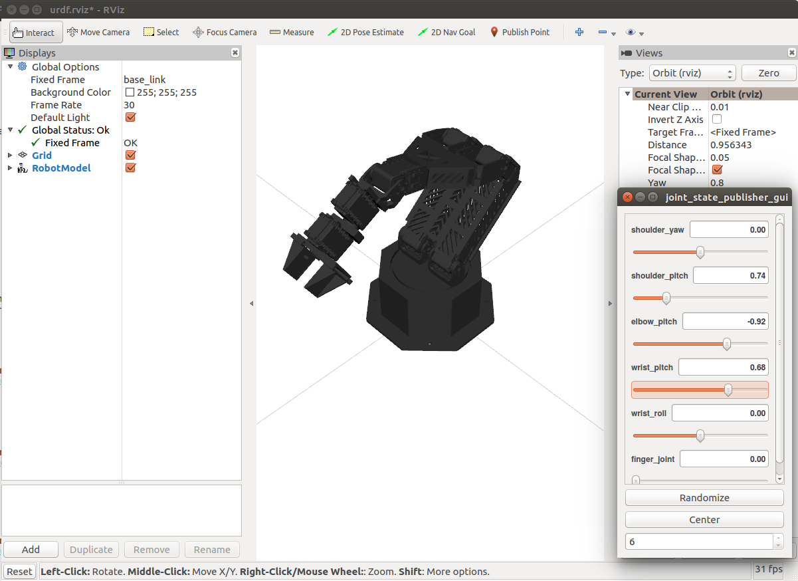

reactor_description
===================

ROS package providing a URDF model of the Trossen Robotics ReactorX.

View the arm in `RViz` by running

    roslaunch reactor_description display.launch gui:=true

